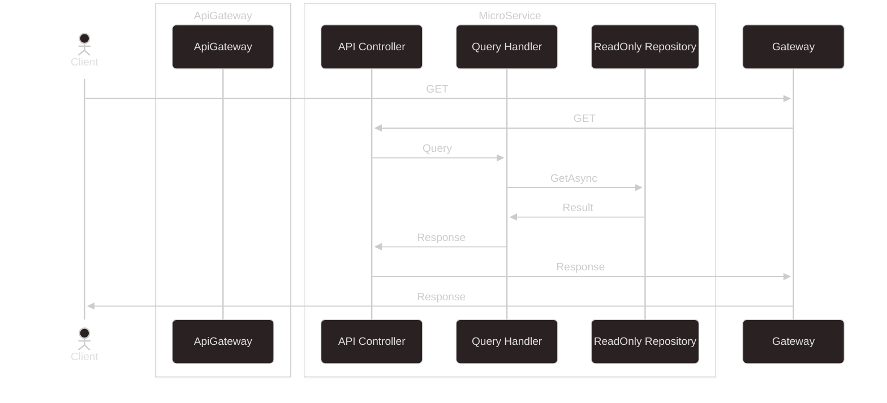

# Wally.CleanArchitecture

[[_TOC_]]

## Sequence Diagram

## Components

### Swagger

UI: https://localhost:7197/swagger/index.html

### Health Checks

AppVer: https://localhost:7197
Health: https://localhost:7197/healthchecks

UI: https://localhost:7197/healthchecks-ui
UI cfg: https://localhost:7197/healthchecks-api/ui-settings

API: https://localhost:7197/healthchecks-api

Webhooks: https://localhost:7197/healthchecks-webhooks

[website](https://github.com/xabaril/AspNetCore.Diagnostics.HealthChecks)

### AutoMapper

[WebSite](https://automapper.org/)
